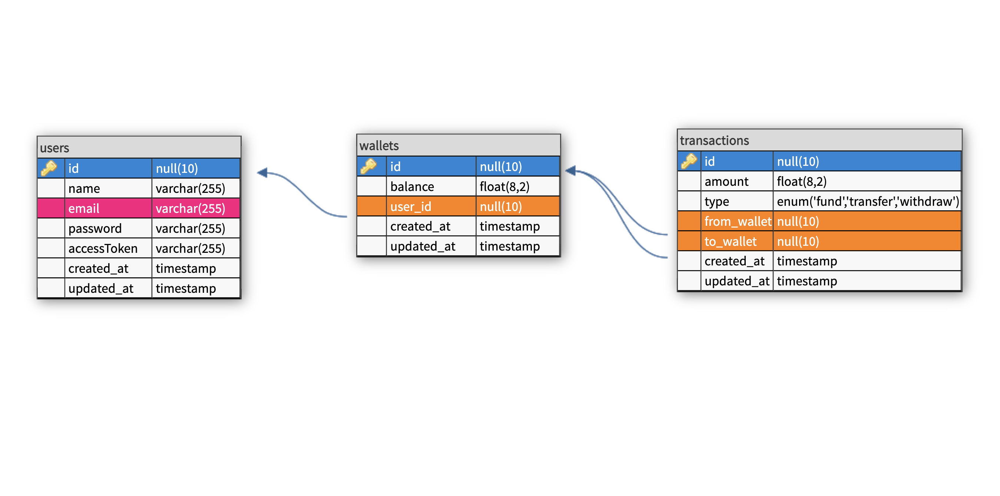

## Lendsqr BE Task

This is a NodeJS API with TypeScript implementation that serves as an MVP for a wallet service. The wallet service enables users to create an account, login, fund their account, transfer funds to other users, and withdraw funds from their account.

## Tech Stack 🔥

- NodeJS
- KnexJS ORM
- MySQL database
- TypeScript

## Table of Contents 📖

- [Features](#features)
- [Getting Started](#getting-started)
- [API Endpoints](#api-endpoints)
- [Authentication](#authentication)
- [Testing](#testing)
- [Database Design](#database-design)
- [Deployment](#deployment)

## Features 💡

1.  User Account Creation: Users can create an account.
2.  User Login: Users can login using **email** and **password**
3.  Fund wallet: Users can fund their wallet.
4.  Fund Transfer: Users can transfer funds from their wallet to another user's wallet.
5.  Withdrawal: Users can withdraw funds from their wallet.

## Getting Started 🏎️

Follow these steps to get started:

1.  Clone the repository: `git clone` [`https://github.com/osuobiem/lsq-take-home`](https://github.com/osuobiem/lsq-take-home)
2.  Install the project dependencies: `npm install`
3.  Setup the MySQL database
4.  Rename the `.env.example` file to `.env` and fill the empty fields with your local database configuration details.
5.  Run database migrations: `npx knex migrate:latest`
6.  Run `npm run dev` to start the application

🚨Make sure you have **NodeJS** and **Typescript** installed before following the above-listed steps.

## **API Endpoints 🚪**

The API provides the following endpoints:

- **POST /api/user**: Create a new user account.
- **POST /api/user/login**: Create a new user account.
- **PUT /api/wallet/fund**: Fund the user's wallet.
- **PUT /api/wallet/transfer**: Transfer funds to another user's wallet.
- **PUT /api/wallet/withdraw**: Withdraw funds from the user's wallet.

For more detailed information about each endpoint and their request/response structures, please refer to the API documentation provided in the [Postman collection](https://www.postman.com/red-sunset-250380/workspace/my-workspace/collection/5115719-35c0dfea-70cc-4e65-945b-6c01c2d1c275?action=share&creator=5115719).

## **Authentication 🔐**

This MVP uses faux token-based authentication. A full authentication system is not implemented for this assessment.

## **Testing**

Unit tests have been written to cover both positive and negative test scenarios. The tests do not cover all parts of the application.

Run the tests using the following command:

```plaintext
npm test
```

## **Database Design**

The database design is represented by the Entity-Relationship (E-R) Diagram below.



## **Deployment**

The API has been deployed to Render and is accessible at the following URL:

**[https://lendsqr-be-test.onrender.com](https://lendsqr-be-test.onrender.com)**
